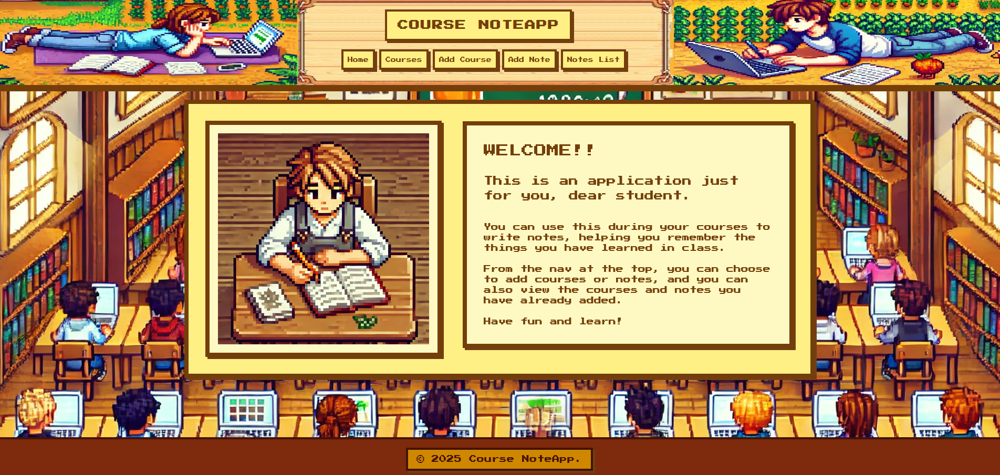
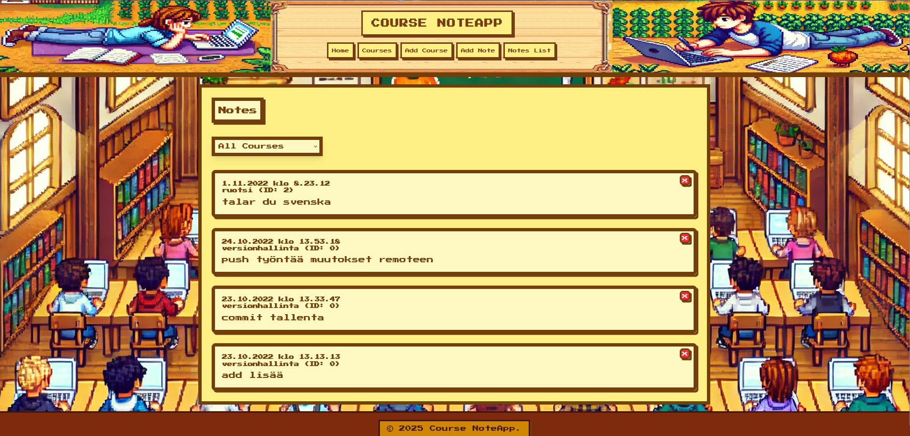
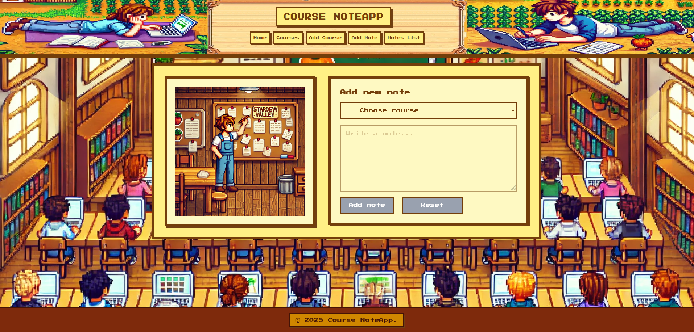
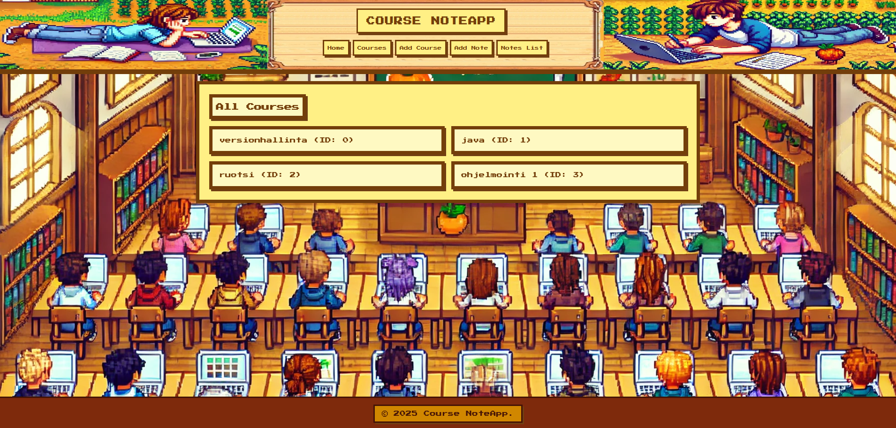

# 📚 NoteAPP

## 🔍 Sovelluksen ominaisuudet

### 📖 Etusivu

- Yksinkertainen tervetulonäkymä, josta on helppo navigoida eri toimintoihin.

<br>

<table>
  <tr>
    <th style="text-align:center;">Desktop</th>
  </tr>
  <tr>
    <td style="text-align:center;">
      
    </td>
  </tr>
  <tr>
    <th colspan="2" style="text-align:center;">
      <em>Klikkaa kuvaa nähdäksesi sen suurempana</em>
    </th>
  </tr>
</table>


---

## 📝 Muistiinpanot

- Tarkastele kaikkia tai yksittäisen opintojakson muistiinpanoja.
- Lisää muistiinpanoja valitulle kurssille.
- Poista muistiinpanoja.
- Selkeät ilmoitukset, jos muistiinpanoja tai opintojaksoja ei löydy.

<br>

<table>
  <tr>
    <th style="text-align:center;">Desktop</th>
  </tr>
  <tr>
    <td style="text-align:center;">
      
    </td>
  </tr>
  <tr>
    <th colspan="2" style="text-align:center;">
      <em>Klikkaa kuvaa nähdäksesi sen suurempana</em>
    </th>
  </tr>
</table>


<br>

<table>
  <tr>
    <th style="text-align:center;">Desktop</th>
  </tr>
  <tr>
    <td style="text-align:center;">
      
    </td>
  </tr>
  <tr>
    <th colspan="2" style="text-align:center;">
      <em>Klikkaa kuvaa nähdäksesi sen suurempana</em>
    </th>
  </tr>
</table>


---

## 🎓 Kurssit

- Kurssien listaaminen ja lisäys

<br>

<table>
  <tr>
    <th style="text-align:center;">Desktop</th>
  </tr>
  <tr>
    <td style="text-align:center;">
      
    </td>
  </tr>
  <tr>
    <th colspan="2" style="text-align:center;">
      <em>Klikkaa kuvaa nähdäksesi sen suurempana</em>
    </th>
  </tr>
</table>


<br>

<table>
  <tr>
    <th style="text-align:center;">Desktop</th>
  </tr>
  <tr>
    <td style="text-align:center;">
      
    </td>
  </tr>
  <tr>
    <th colspan="2" style="text-align:center;">
      <em>Klikkaa kuvaa nähdäksesi sen suurempana</em>
    </th>
  </tr>
</table>


---

## 🛠️ Käytetyt teknologiat

- Vite
- SWR
- React
- React Router
- Tailwind CSS
- Zustand (tilanhallinta)

---

## 🚀 Projektin ottaminen käyttöön

Asenna riippuvuudet ja käynnistä sovellus paikallisesti:

```
npm install
npm run dev
```

---

## 🌐 REST API -integraatio

Sovellus hakee datan seuraavista REST API -osoitteista:

- Kurssit: [Courses](https://luentomuistiinpano-api.netlify.app/.netlify/functions/courses)
- Muistiinpanot: [Notes](https://luentomuistiinpano-api.netlify.app/.netlify/functions/notes)

---

## 🤖 Tekoälyn käyttö

Projektissa hyödynsin ChatGPT o4 -mallia kehityksen apuna erityisesti seuraavissa:

- Tyylittelyn ja suunnittelun apuna, koska mielessä oli tietty teema jota hain takaa eli stardew valley.
- Kysytty apua erinäisiä vinkkejä ja neuvoja miten tehdä tietty tyyli tailwindillä. Ja sekä värikoodien löytämiseen ja joistan tyylistä yksinkertaisempi koodilla.
- Tässä dokumentaatiossa (kieliasussa).
- Siistimisessä, että koodi näyttää puhtaammalta.
- Datan haku eli miten swr toimii tarkemmin, dokumentaation lisäksi.
- Ongelmanratkaisussa ja teknisten konseptien selittämisessä.
- Kuvat on luotuu tekoälyllä ja muokattu itse jälkeenpäin joitakin kohtia kuvankäsittelyohjelmalla

Tekoäly ei toiminut suorana lähteenä koodille, vaan oppimisen tukena, varmistaen dokumentaation avulla aina ratkaisujen oikeellisuuden. 

---

## 💡 Omakohtainen kokemus

Tämä projekti opetti minulle valtavasti uutta Reactista ja miten käyttää eri tyylejä. Aluksi kyllä oli pieniä haasteita syntaksin kanssa, projekti auttoi minua ymmärtämään modernien web-sovellusten rakennetta ja toimintaa syvällisemmin. 

Olen erittäin tyytyväinen projektin lopputulokseen ja mitä oppisin projektin aikana. Ainoastaan gitin laiskat -commitit ja niiden lyhyehköt kuvaukset jäivät vähän harmittamaan.

---

## 🛠️ Korjattaa ei vielä valmis / jatkokehitys

- Kuten selaimen kokoa muuttelemalla huomaa ei näkymä ole ihan täysin responsiivinen ja eikä sitä ole optimoitu mobiilille ollenkaan, koska se ei ollut lopputyön tarkoituksena, siksi se näyttää kamalalta mobiilissa.
- Optimoida responsiiviseksi mobiilille ja että sitä pystyisi myös käyttämään mobiilissa ja mahdollisesti uusia kokonaan kuvat ja miltä NoteAPP näyttäisi jatkossa.
- Siistiä koodia enemmän ja mahdollisesti järjestää joitain asioita uusiksi.

---
